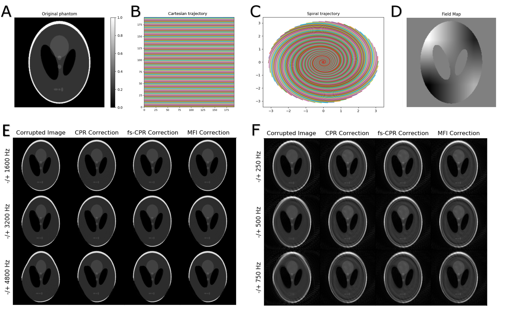

---

title: 'Off-resonance CorrecTion OPen soUrce Software (OCTOPUS)' tags:
- Python
- MRI
- off-resonance correction authors:
- name: Marina Manso Jimeno orcid: 0000-0002-1141-2049 affiliation: 1
- name: John Thomas Vaughan Jr. orcid: 0000-0002-6933-3757 affiliation:
  1
- name: Sairam Geethanath orcid: 0000-0002-3776-4114 affiliation: 1

affiliations:
- name: Columbia Magnetic Resonance Research Center, Columbia University
  in the City of New York, USA index: 1 date: 21 July 2020 bibliography:
  paper.bib

---

# Summary

`OCTOPUS` is a Python-based software for correction of off-resonance
artifact in Magnetic Resonance (MR) images. It implements three different
methods, it's general to the image acquisition scheme and can be run in
the browser, making it a very flexible and customizable tool.

# Statement of need

Off-resonance is an MR artifact whose source can vary from field
inhomogeneities, to differences in tissue susceptibilities and chemical
shift [@Noll1991]. These phenomena can cause the phase of off-resonant
(not at the resonant or Larmor frequency) spins to accumulate along the
read-out direction, which can turn into blurring, geometrical distortion
and degradation in the reconstructed image [@LukPat2001]. Images
acquired using long readout trajectories and/or at high fields where the
field homogeneity is lower, are more prone to this problem. However,
such an acquisition scenario also delivers desirable properties, such as
short scanning times, gradient efficiency, motion tolerance and better
signal-to-noise ratio [@Chen2008].

Multiple successful off-resonance correction methods have been reported
by the literature [@Schomberg1999]. Most of them are based on Conjugate
Phase Reconstruction (CPR), a method which counteracts the accumulated
phase by demodulating k-space data with its conjugate [@Maeda1988]. From
the original CPR, faster and more efficient implementations were
developed, such as frequency-segmented CPR [@Noll1992] and
Multi-Frequency Interpolation (MFI) [@Man1997].

One can find limited off-resonance correction capabilities within
existing packages. Examples are: SPIRiT [@Lustig2010], a MATLAB-based
approach for auto-calibrated parallel imaging reconstruction; Ostenson's
MFI implementation for Magnetic Resonance Fingerprinting (MRF)
[@Ostenson2017]; FUGUE, a tool for Echo-Planar Imaging (EPI) distortion
correction part of the FSL library [@Jenkinson2012]; and the MIRT
toolbox, a MATLAB-based MRI reconstruction package that offers field
inhomogeneity correction using iterative reconstruction
methods[@Sutton2003; @Fessler2005]. Nylund's thesis [@Nylund2014] also
contains source MATLAB code for fs-CPR and MFI correction of spiral
images.

All of the mentioned implementations are highly specific, defined for a
particular k-space trajectory, application and/or include a single
correction method. These limitations typically lead researchers to
adjust their data in an attempt to fit it into the available pipelines
or to write their own version of the methods. Either approach results in
a significant investment of time and effort and can generate isolated
implementations and inconsistent results. Furthermore, most of the
available packages are also MATLAB-based, restricting the portability,
accessibility and customization of the code [@Ravi2018].

`OCTOPUS` - a Google Colab notebook compatible implementation - is aimed
at filling this gap in MR off-resonance correction packages. It provides
Python open-source code for three fundamental methods (CPR, fs-CPR and
MFI). The implementation is independent of the application and the image
acquisition scheme, easing its integration into any reconstruction
pipeline. `OCTOPUS` is the first zero-footprint off-resonance
correction software given that it can also run in a web browser.

# Short demo
The package leverages functionalities of other Python libraries, specifically NumPy [@2020NumPy], SciPy [@2020SciPy], scikit-image [@scikit-image], NiBabel[@Nibabel], Matplotlib [@Matplotlib], OpenCV [@itseez2015opencv], Pydicom [@darcy_mason_2020_3891702], and PyNUFFT[@pynufft], 
To illustrate the usage of the package we performed in silico numerical
simulations using a Cartesian trajectory, a spiral trajectory and a
simulated field map using a Shepp-Logan phantom.  The procedure steps were:

1. Forward model simulation of off-resonance effect on a 192x192
   Shepp-Logan phantom (Figure 1.A).

   + Using a Cartesian trajectory (Figure 1.B) and a simulated field map
     (Figure 1.D) with frequency ranges of -/+ 1600, -/+3200 and -/+4800
     Hz.

   + Using a spiral trajectory (Figure 1.C) and a simulated field map
     (Figure 1.D) with frequency ranges of -/+ 250, -/+ 500 and -/+ 750
     Hz.

2. Correction of the results of the forward model (Figure 1.E and Figure
   1.F, first column) with CPR, fs-CPR and MFI (Figure 1.E and Figure
   1.F, second-fourth columns).

In both sets of experiments, 'OCTOPUS' has successfully corrected the
off-resonance induced blurring and/or geometrical distortion. Note that
spiral and reconstruction-related artifacts are still present in the
spiral simulated images.

# Acknowledgements

This study was funded (in part) by the 'MR Technology Development Grant'
and the 'Seed Grant Program for MR Studies' of the Zuckerman Mind Brain
Behavior Institute at Columbia University (PI: Geethanath) and the 'Fast
Functional MRI with sparse sampling and model-based reconstruction' of
the National Institute of Biomedical Imaging and Bioengineering (PI:
Fessler and, supplement, sub-award to Geethanath).

# References

